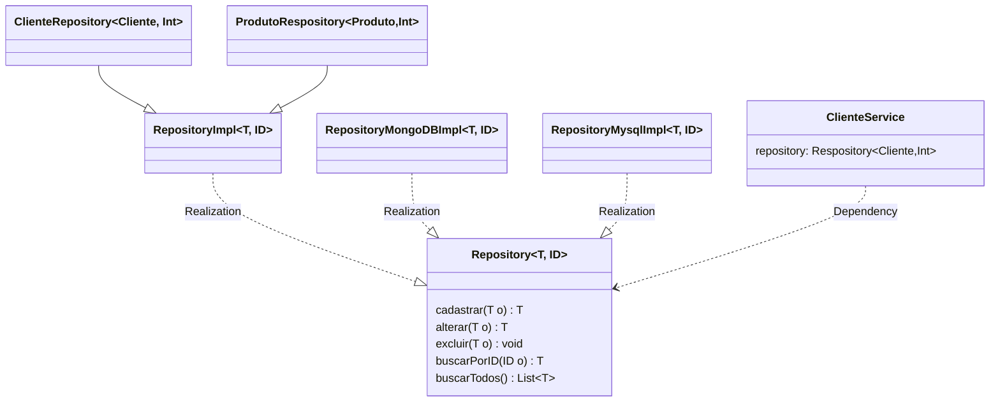

```mermaid 
classDiagram

RepositoryImpl~T, ID~  ..|> Repository~T, ID~  : Realization
RepositoryMongoDBImpl~T, ID~  ..|> Repository~T, ID~  : Realization
RepositoryMysqlImpl~T, ID~  ..|> Repository~T, ID~  : Realization
ClienteRepository~Cliente, Int~ --|> RepositoryImpl~T, ID~
ProdutoRespository~Produto,Int~ --|> RepositoryImpl~T,ID~
ClienteService ..> Repository : Dependency

class ClienteService{
      repository: Respository~Cliente,Int~
}

class Repository~T, ID~{
  
  cadastrar(T o)   T 

  alterar(T o)  T  

  excluir(T o)  void

  buscarPorID(ID  o)  T

  buscarTodos()  List~T~ 
}


```