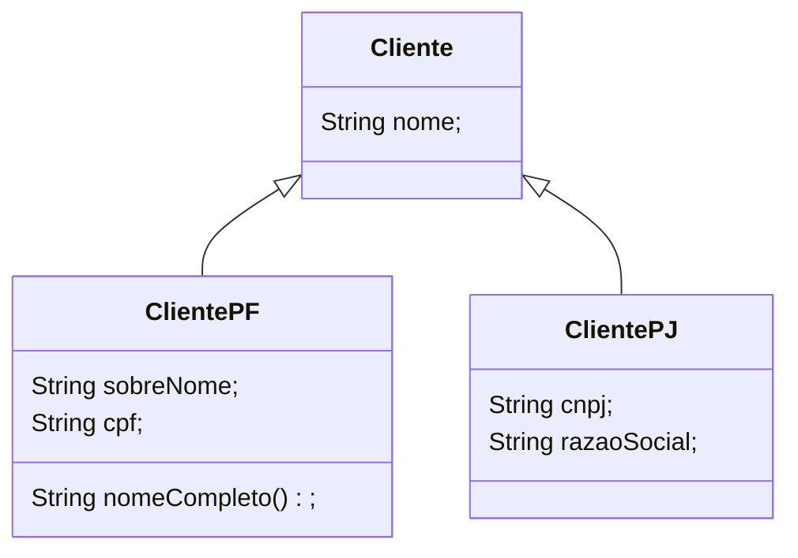

```mermaid 
classDiagram

Cliente <|-- ClientePF
Cliente <|-- ClientePJ

class Cliente {
  String nome;
}

class ClientePF  {
  String sobreNome;
  String cpf;
  String nomeCompleto();
}


class ClientePJ {
  String cnpj;
  String razaoSocial;
}

```